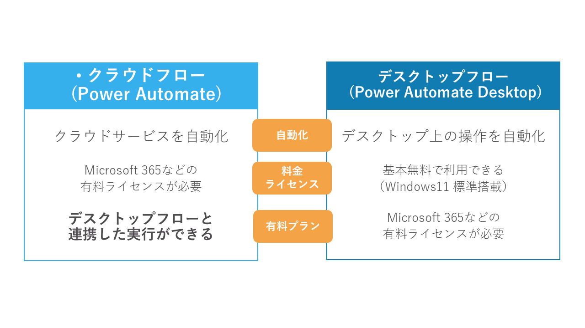

Power Automateを始めるための、チュートリアルです。Power Automateの基本的な使い方を学びます。

# 目次
- [概要](./README.md)
### クラウドフロー
- [今回作成するクラウドフロー](./c-00-flowimage.md)
- [フロー作成画面を開く](./c-01-access-powerautomate.md)
- [トリガーを設定する](./c-02-trigge.md)
- [添付ファイルをOneDriveに保存する](./c-03-attachment.md)
- [Teamsに通知する](./c-04-teams.md)
- [テストする](./c-05-test.md)
- [まとめ](./c-06-summary.md)

### デスクトップフロー
- [今回作成するデスクトップフロー](./d-00-flowimage.md)
- [フロー作成画面を開く](./d-01-access-powerautomate.md)
- [フローを記録する](./d-02-recordflow.md)
- [メッセージボックスを追加する](./d-03-messagebox.md)
- [実行する](./d-04-run.md)
- [まとめ](./d-05-summary.md)

# Power Platformとは
Power Platformは、ビジネスアプリケーションを作成するためのプラットフォームです。

Power Platformには、以下の製品が含まれています:

| サービス名  | 説明 |
| ------------- | ------------- |
| **Power Automate** | **ワークフローの自動化** |
| Power Apps | Webアプリ開発 |
| Power BI | データ分析・グラフ化 |
| Microsoft Copilot Studio | チャットボット開発 |
| Power Pages | サイト作成 |

どのサービスも、ローコード（プログラミングをせずにシステムを開発する方法）で作成できるのが特徴です。

# Power Automateとは
Power Automateは、ワークフローの自動化を行うためのサービスです。
メールの移動やデータの入力など、単純作業のシステムを作成・自動実行することができます。

# Power Automateの種類
Power Automateには、2種類のサービスがあり、連携させることができます。
## Power Automate（クラウドフロー）
Power Automate（クラウドフロー）は、**クラウド上で**動作するワークフローシステムです。 
Microsoft 365やDynamics 365、SharePointなどのサービスと連携することができます。 
有料プランを利用することで、後述するデスクトップフローとの連携も可能です。

## Power Automate Desktop（デスクトップフロー）
Power Automate Desktop（デスクトップフロー）は、**デスクトップ上で**動作するワークフローシステムです。 
Windows上で動作するため、WindowsアプリケーションやWebアプリケーションと連携することができます。 

どちらのサービスも、ノーコード・ローコードで作成できます。

# Power Automateのチュートリアル
次のページから、実際のPower Automateの使い方を学びます。

## 目次
### クラウドフロー
1. [今回作成するクラウドフロー](./c-00-flowimage.md)
2. [フロー作成画面を開く](./c-01-access-powerautomate.md)
3. [トリガーを設定する](./c-02-trigger.md)
4. [添付ファイルをOneDriveに保存する](./c-03-attachment.md)
5. [Teamsに通知する](./c-04-teams.md)
6. [テストする](./c-05-test.md)
7. [まとめ](./c-06-summary.md)

### デスクトップフロー
1. [今回作成するデスクトップフロー](./d-00-flowimage.md)
2. [フロー作成画面を開く](./d-01-access-powerautomate.md)
3. [フローを記録する](./d-02-recordflow.md)
4. [メッセージボックスを追加する](./d-03-messagebox.md)
5. [実行する](./d-04-run.md)
6. [まとめ](./d-05-summary.md)

---
 [🏠](./README.md) | ➡️ [今回作成するクラウドフロー](./c-00-flowimage.md)

