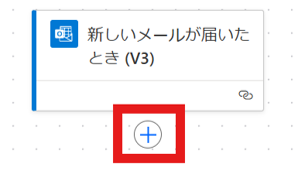
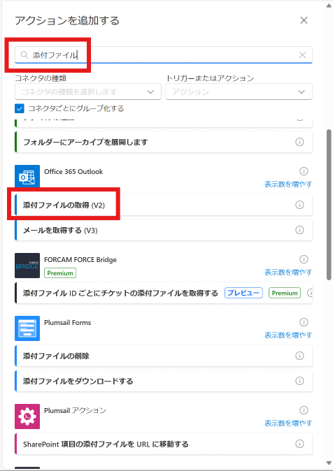
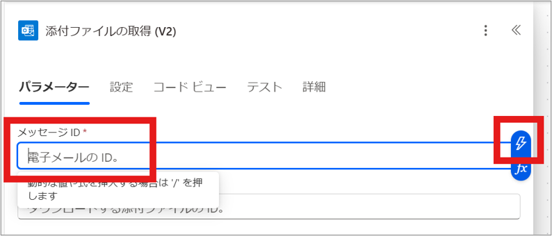
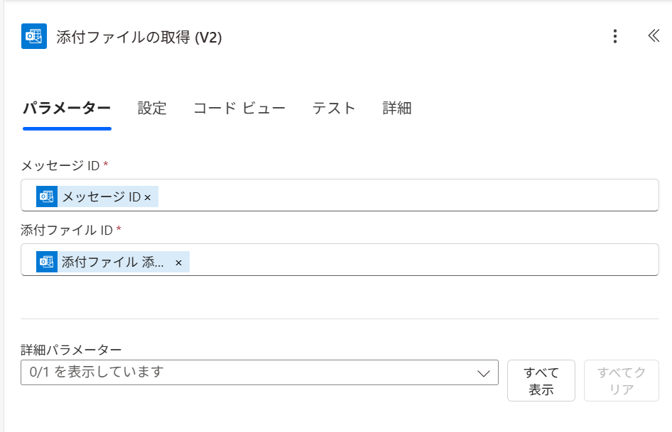
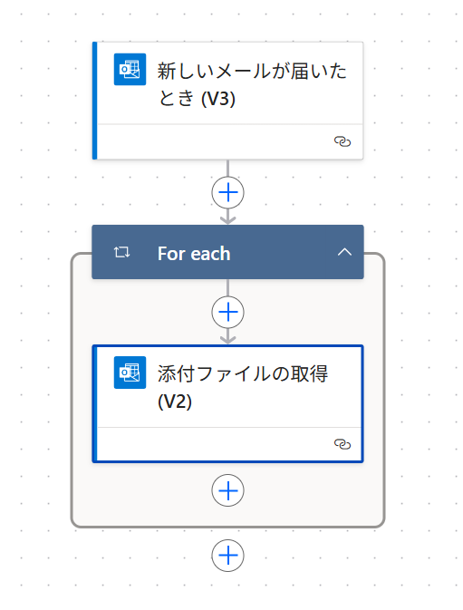
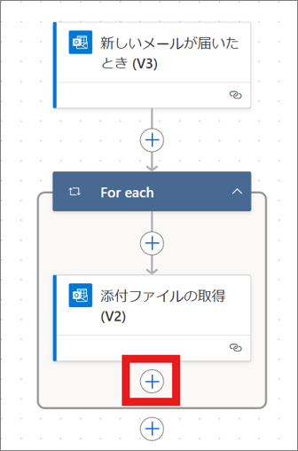
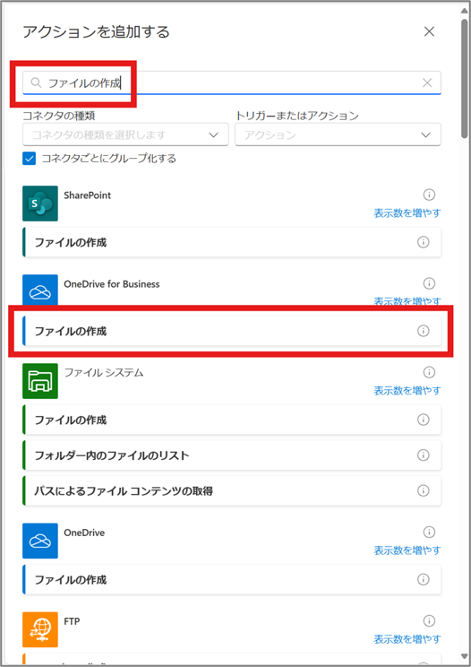
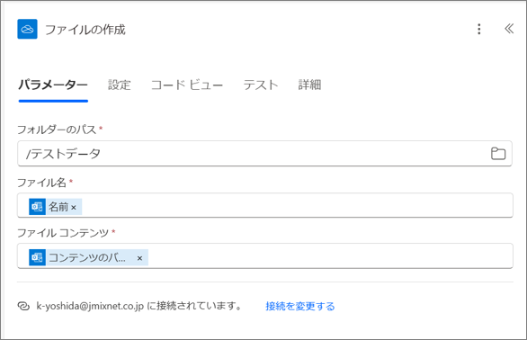
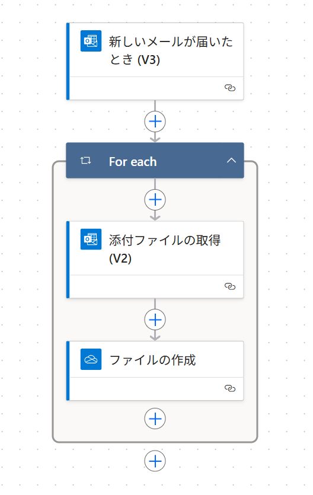

# 添付ファイルをOneDriveに保存する
先ほどのトリガーで取得した添付ファイルを、OneDriveに保存する処理を設定します。

## 添付ファイルの取得
1. トリガーの下にある「+」ボタンをクリックします 

2. 検索バーに「添付ファイル」と入力し、Office 365 Outlookの「添付ファイルの取得(V2)」アクションをクリックします 

> [!Note]
> アクションとは、フロー内で実行される処理のことです。
> トリガーと違い、1つのフローに対して複数のアクションを設定できます。
3. メッセージIDの入力欄をクリックし、右側に表示される⚡マークをクリックします 

4. 「表示数を増やす」をクリックします 

5. 「メッセージID」を選択します
> [!Note]
> 3~5の手順で設定することで、メッセージIDの値を毎回自動的に取得できるようになります。
> このような設定を「**動的コンテンツ**」と呼びます。
6. 同様に、添付ファイルIDの入力欄にも「添付ファイルID」の動的コンテンツを設定します

>[!Tip]
>ここまで設定すると、自動的に「For each」という処理が追加されます。 
> 
>For eachは、反復処理が必要になるアクションに、自動的に適用されます。 
>今回のケースでは、1つのメールに対し、ファイルが複数添付されていることが想定されます。 
>添付ファイルの取得(V2)アクションは、添付ファイルごとに反復処理を行う必要があるため、自動的にFor eachが作成されます。

## OneDriveに保存
1. 「For each」アクションの**中にある**「+」ボタンをクリックします 

2. 検索バーに「ファイルの作成」と入力し、「ファイルの作成」アクションをクリックします 

> [!IMPORTANT]
> 「OneDrive **for Business**」を選択してください。 
>「OneDrive」は個人向けなので、利用できません。
3. 「フォルダーのパス」を、📁マークから設定します
4. 「ファイル名」を、動的なコンテンツの「名前」に設定します
5. 「ファイル コンテンツ」を、動的なコンテンツの「コンテンツのバイト数」に設定します 

## これで、添付ファイルをOneDriveに保存する処理が完了しました

---
[02-トリガーを設定する](./c-02-trigger.md) ⬅️ | [🏠](./README.md) | ➡️ [04-Teamsに通知する](./c-04-teams.md)
