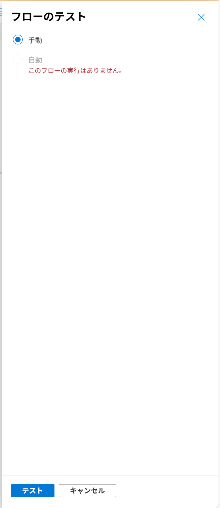
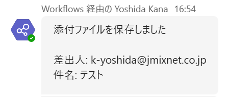
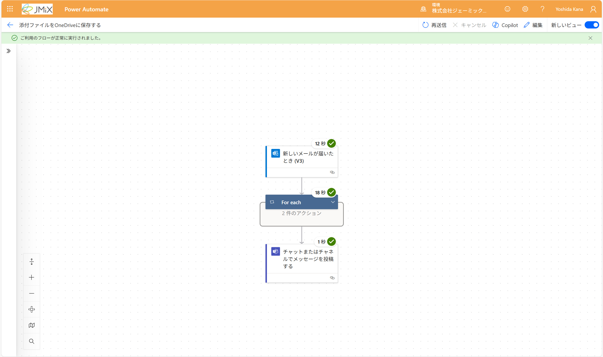

# テストする

## 保存する
1. フローが完成したら、画面右上にある「保存」ボタンをクリックします

2. エラーがない場合は、このように表示されます

> [!Note]
> エラーがある場合は、保存できず、エラーメッセージが表示されます。 
> 指定された部分を確認し、修正しましょう
> 

## テストする
0. 事前に、ファイルが添付されているメールを作成します。この時、メールの宛先（差出人）と件名は、フローで設定した通りにします。
> [!IMPORTANT]
> まだ送信せず、待機させておいてください
1. 画面右上の「テスト」をクリックします 

2. 手動を選択し、「テスト」をクリックします 

> [!Note]
> 2回目以降は自動が選択できます。
> 自動を選択すると、過去ののトリガー情報を使ってテストすることができます。
3. トリガーの開始まで待機中になるため、このタイミングでメールを自分宛に送信します。
4. メールを受信すると、フローが自動的に起動し、処理を行います。テスト画面で処理の状況を確認することができます。 

5. また、Teamsのアクションが実行されると、workflowボットからメッセージが送信されます 

> [!Note]
> workflowボットは個人に展開されるボットです。通知の内容は他の人は閲覧できません。

## 実行結果を確認する
実行が完了すると、テスト画面で詳細な処理を確認できます。 
 
トリガー・アクションをクリックすると、入出力の値が確認できます。

## 以上で、クラウドフローは完成です。
フローの保存後、トリガー条件に合致したイベントが発生すると、自動的にフローが開始されます。

---
[04-Teamsに通知する](./c-04-teams.md) ⬅️ | [🏠](./README.md) | ➡️ [06-まとめ](./c-06-summary.md)
