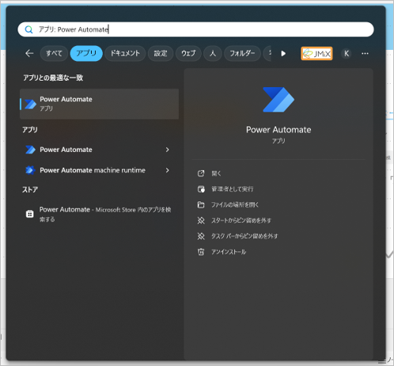
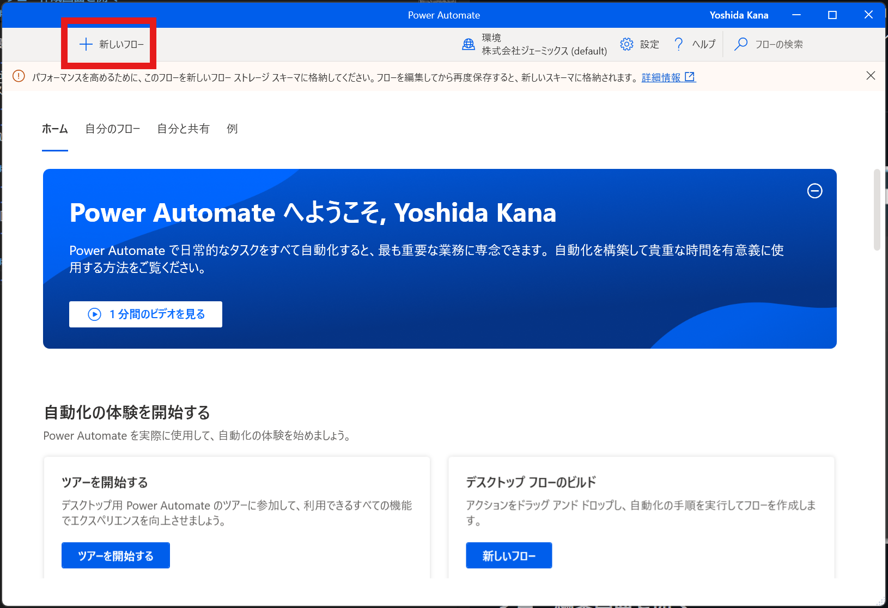
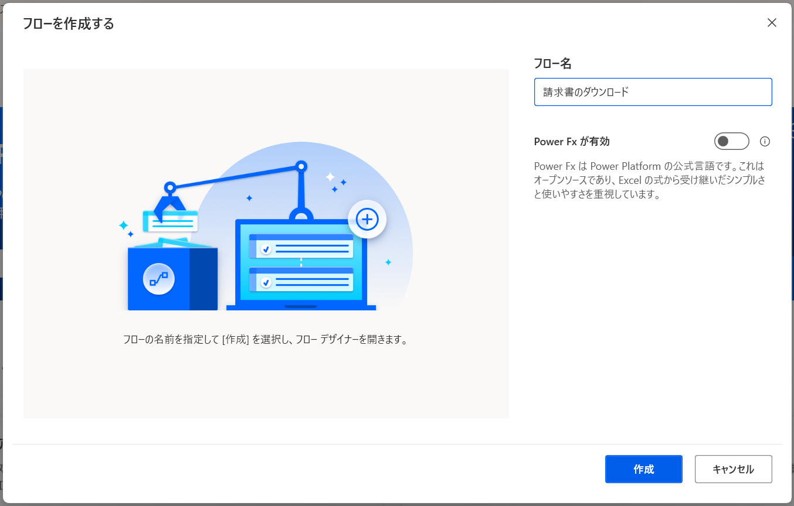
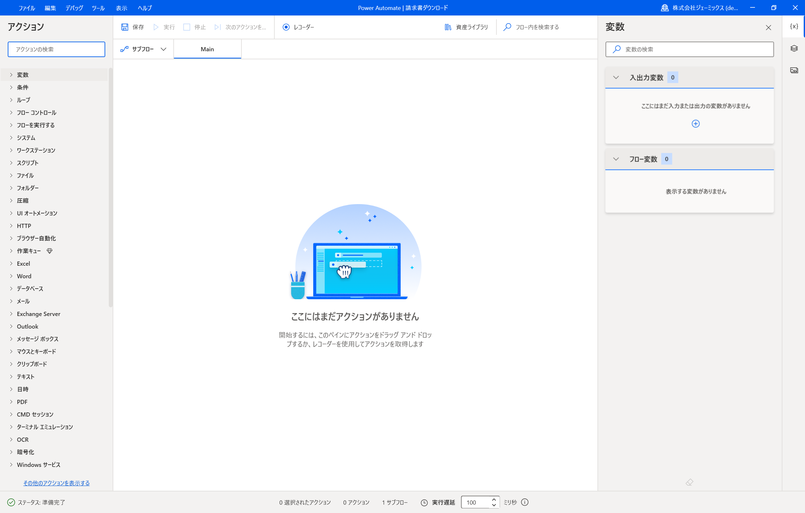

# フロー作成画面を開く
## Power Automate Desktopのインストール
> [!NOTE]
> Windows11では、Power Automate Desktopは初期状態でインストールされています 
> アンインストールしてしまった方や、Windows11以外のOSを利用している方は最初にアプリのインストールを行ってください
1. [Power Automate Desktopのドキュメントサイト](https://learn.microsoft.com/ja-jp/power-automate/desktop-flows/install)にアクセスします
2. インストーラーのダウンロードリンクをクリックし、ダウンロードします
3. インストーラーを実行すると、Power Automate Desktopがインストールされます

## Power Automate Desktopを起動する
1. Windowsキーを押し、スタートメニューを表示します 
2. 「Power Automate」と検索し、アプリを開きます 

3. 必要ならサインインします

## フロー編集画面を開く
1. 「+新しいフロー」をクリックします 

2. フロー名を入力します
3. 作成ボタンをクリックします 

4. フロー編集画面が開きます 

---
[00-今回作成するデスクトップフロー](./d-00-flowimage.md) ⬅️ | [🏠](./README.md) | ➡️ [02-フローを記録する](./d-02-recordflow.md)
