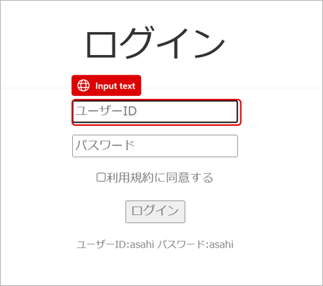

# フローを記録する
Power Automate Desktopには、アクションを設定する方法が2種類あります。<br>
まずは、**レコーダー機能**を使って設定します。

> [!NOTE]
> レコーダー機能とは、手動での操作を記録して、フローに反映させる機能です。<br>
> アクションを一つ一つ設定しなくても良いため、全体を大まかに設定するときに向いている方法です。

## 記録したい処理
レコーダーで記録する前に、どのような作業を自動化するかを確認していきます。<br>
以下の手順を、まずは手作業で動かして確認してください。
1. ブラウザを開き、[アクセスしたいサイト](https://support.asahi-robo.jp/practice/)に移動する
> ![TIPS]
> 今回は、ASAHI Accounting Robot 研究所が公開しているPower Automate Desktop練習用サイトを使います。
2. ログイン画面に移動する
3. ID・パスワードを入力し、利用規約に同意する
4. ログインボタンをクリックしてログインする
5. 「売上一覧」に移動する
6. ダウンロードリンクをクリックする
7. Excel画面に移動した場合、さらにダウンロードボタンをクリックする
8. ブラウザを閉じる

## レコーダーで記録する
先ほどの手順を、実際に記録していきます
1. フローの編集画面を開きます
2. 画面上にある「レコーダー」をクリックします

3. レコーダーが起動するまで待機します

4. レコーダーの「記録」ボタンをクリックします
5. 記録が開始されると、以降のクリック動作が全て記録されます。このまま記録したい処理を行ってください。
> [!TIPS]
> 赤い枠が表示されている状態でクリックすると、上手く記録されます
> 
6. 完了ボタンをクリックすると、記録が停止し、フロー編集画面に記録したアクションが反映されます<br>


## これで、レコーダーで記録する方法は完了です
* 不要なアクションがあった場合、アクションを選択した状態で```Del```キーを押すと削除されます
* 修正したいアクションがあった場合、アクションをダブルクリックすると詳細を設定できます


---
[01-フロー作成画面を開く](./d-01-access-powerautomate.md) ⬅️ | [🏠](./README.md) | ➡️ [03-メッセージボックスを追加する](./d-03-messagebox.md)
