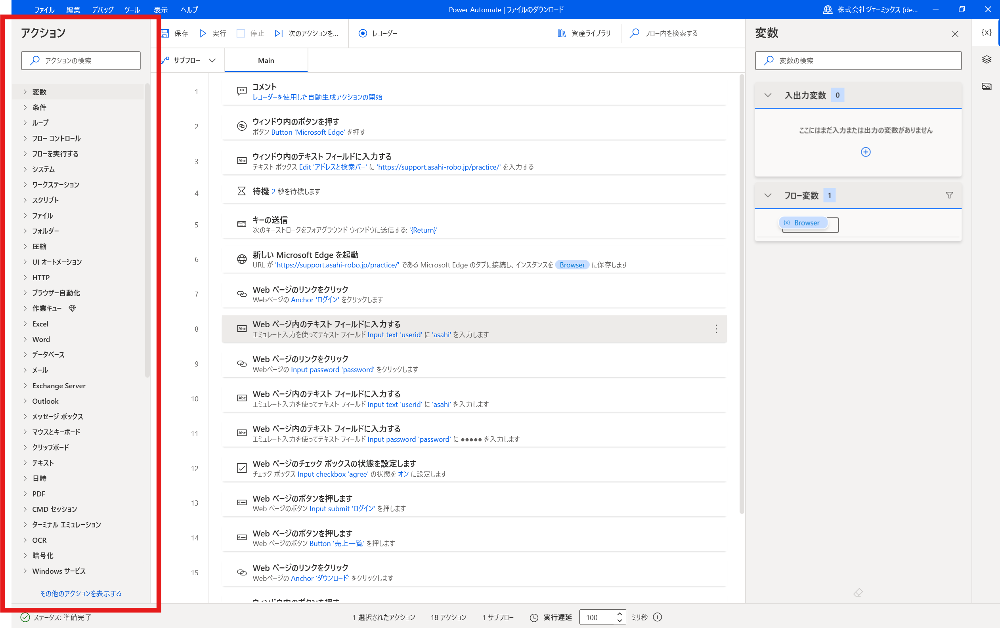
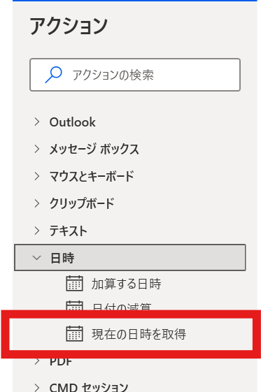
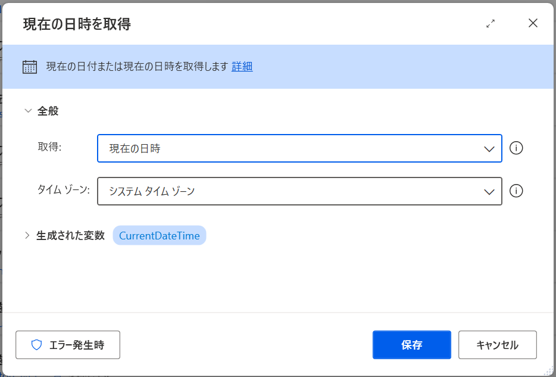
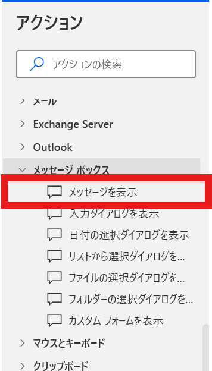
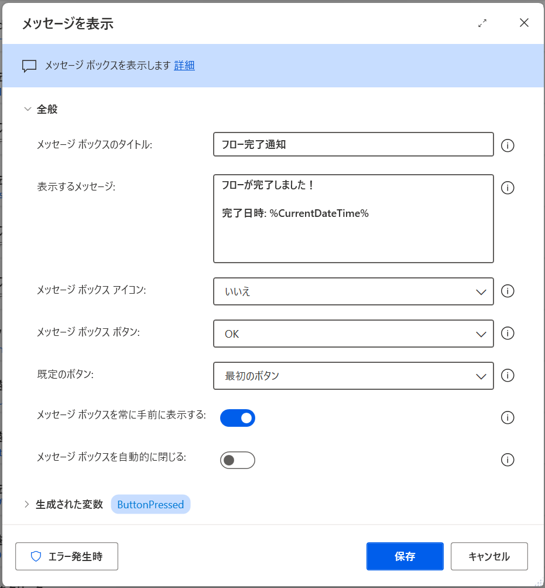
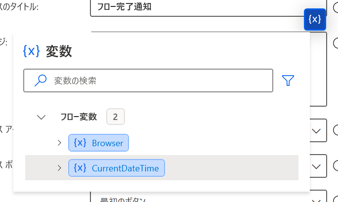
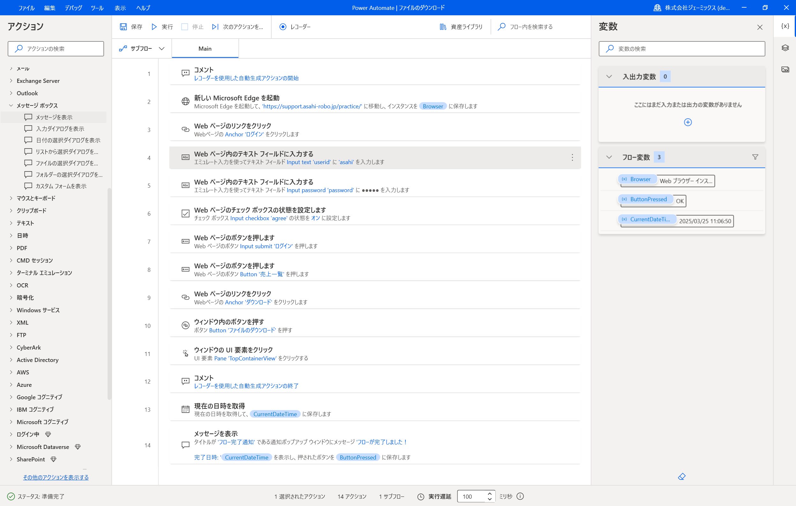

# メッセージボックスを追加する
続いて、アクションを設定するもう1つの方法でメッセージボックスを表示させます。<br>
編集画面の左にあるサイドバーから、アクションをドラッグして配置することができます。


## 日時を取得する
1. 左のサイドバーから、「**日時**」 > 「**現在の日時を取得**」 を選択し、フローの一番下にドラッグします<br>

2. このまま保存ボタンをクリックします

> [!NOTE]
> フローを実行すると、CurrentDateTimeに日時が保存されます。<br>
> このCurrentDateTimeが動的コンテンツ（ここでは「**変数**」と呼びます）として以降の処理で利用できます

## メッセージボックスを表示する
1. 左のサイドバーから、「**メッセージボックス**」 > 「**メッセージを表示**」を選択し、フローの一番下にドラッグします<br>

2. メッセージボックスのタイトルと、表示するメッセージを編集します

> [!NOTE]
> 入力欄に表示される **{x}** をクリックすると、挿入したい変数（動的なコンテンツ）を選択できます。<br>
> もしくは、```%変数名%```という表記でも挿入できます。
> 
3. 「メッセージ ボックスを常に手前に表示する」をオンにします
4. 保存ボタンをクリックします

## これで、フローが完成しました

> [!NOTE]
> 次のページでテスト実行・トラブルシューティングを行いますので、現時点では上記の画像の通りになっていなくても大丈夫です。

---
[02-フローを記録する](./d-02-recordflow.md) ⬅️ | [🏠](./README.md) | ➡️ [04-実行する](./d-04-run.md)
