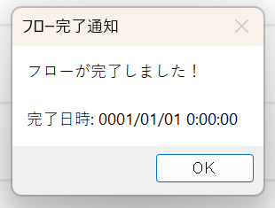
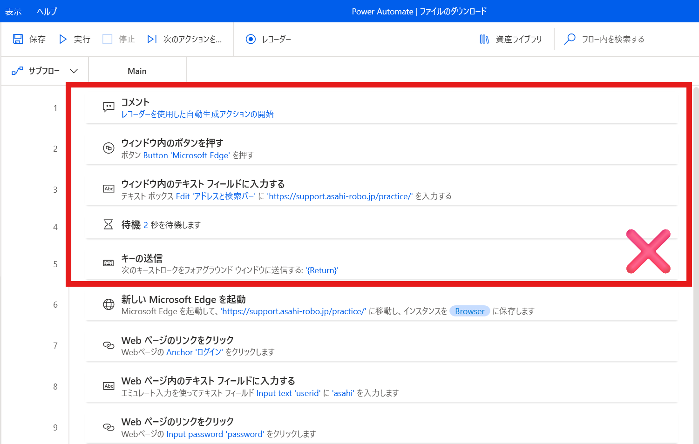
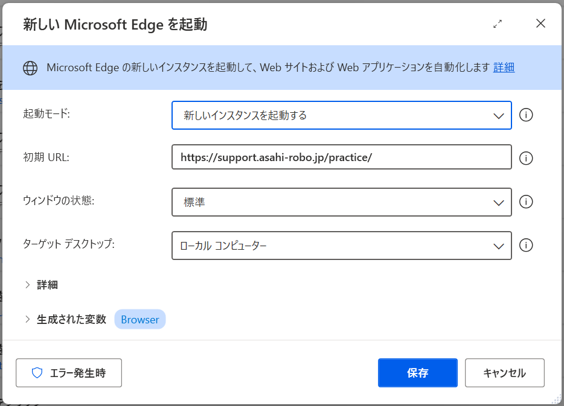
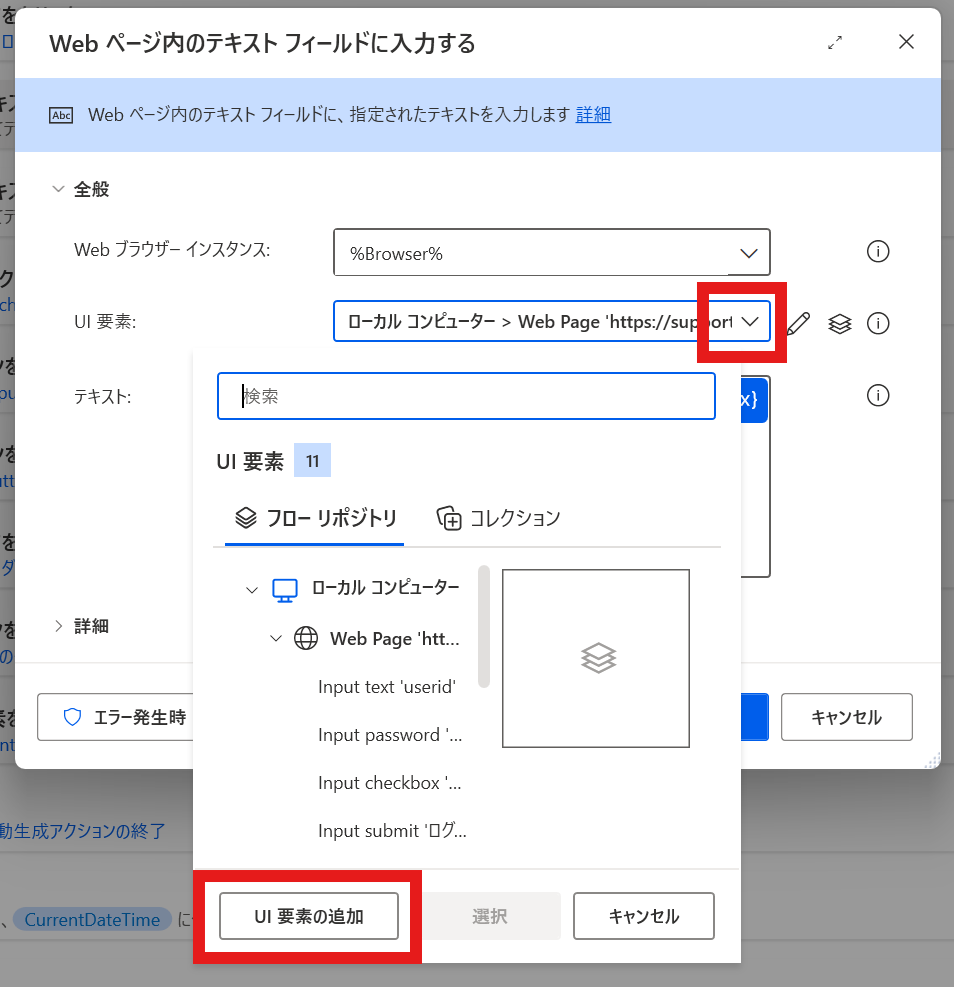
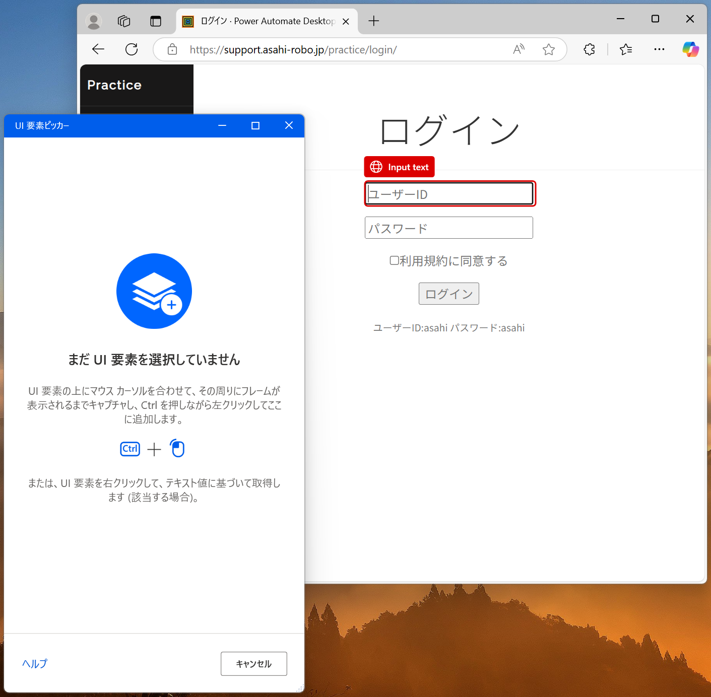
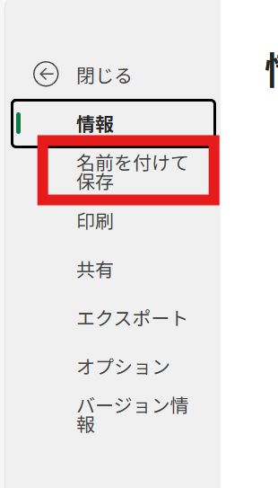
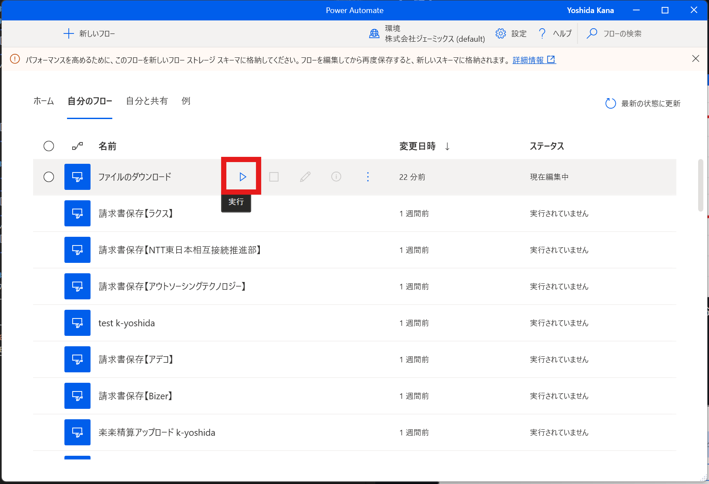

# 実行する

## フローを保存する
1. 画面左上にある「保存」ボタンをクリックして保存します

> [!NOTE]
> クラウドフローと違い、デスクトップフローはエラーがあっても保存できます

## フローを実行する
1. 画面左上にある「実行」ボタンをクリックすると、フローが開始します

2. 以降、実際に記録した通りに、自動でフローが実行するか確認します
3. 最後にメッセージボックスが表示されたら成功です。「OK」をクリックして実行を終了します。


## トラブルシューティング（上手く実行できなかったとき）
### ブラウザが開かない
1. 「新しいMicrosoft Edgeを起動」より前の処理を削除します

2. 「新しいMicrosoft Edgeを起動」をダブルクリックし、下記の通りに設定し直します
    - 起動モード:   新しいインスタンスを起動する
    - 初期URL:  ```https://support.asahi-robo.jp/practice/```
    - ウィンドウの状態: 標準
    - ターゲット デスクトップ:  ローカル コンピュータ

3. 再設定を行ったので、実行ボタンから処理を確認します

### ボタンがクリックできない・入力できない
1. エラーの発生したアクションをダブルクリックします
2. UI要素のプルダウンをクリックし、UI要素の追加をクリックします

3. 再度ブラウザからアクセスし、クリックしたいボタンを```Ctrl```キーを押しながらクリックします

4. 要素を再取得できたので、実行ボタンから処理を確認します

### 「ファイルのダウンロード」が反応しない・表示されない
「ファイルのダウンロード」をクリックするアクションを削除し、「ファイル」タブ→「名前を付けて保存」から保存するように変更してください


## 以上で、デスクトップフローは完成です。
フローの保存後、トップページの実行ボタンからフローを実行することができます。


---
[03-メッセージボックスを追加する](./d-03-messagebox.md) ⬅️ | [🏠](./README.md) | ➡️ [05-まとめ](./d-05-summary.md)
